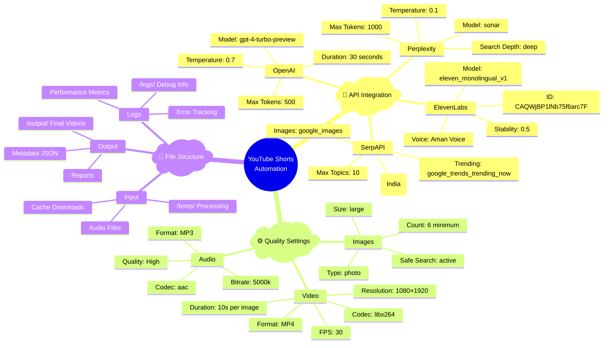
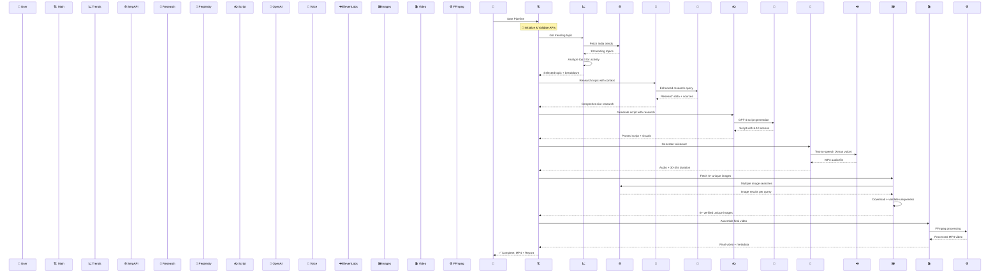
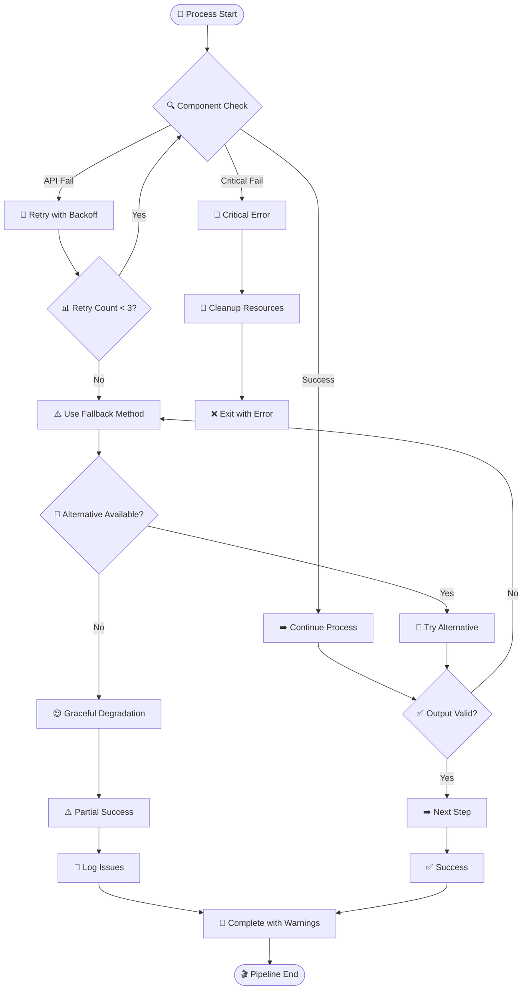

# 🎬 YouTube Shorts Automation - Interactive Visual Diagram

## 🎯 Complete System Architecture Visualization

```mermaid
graph TB
    %% Styling definitions
    classDef startClass fill:#e8f5e8,stroke:#4caf50,stroke-width:3px,color:#000
    classDef processClass fill:#e3f2fd,stroke:#2196f3,stroke-width:2px,color:#000
    classDef apiClass fill:#fff3e0,stroke:#ff9800,stroke-width:2px,color:#000
    classDef decisionClass fill:#f3e5f5,stroke:#9c27b0,stroke-width:2px,color:#000
    classDef errorClass fill:#ffebee,stroke:#f44336,stroke-width:2px,color:#000
    classDef successClass fill:#e8f5e8,stroke:#4caf50,stroke-width:3px,color:#000
    classDef configClass fill:#f1f8e9,stroke:#8bc34a,stroke-width:2px,color:#000

    %% Main Flow
    START([🚀 START PIPELINE]):::startClass --> INIT[🔧 Initialize System]:::processClass
    
    %% Initialization Phase
    INIT --> VAL_API{🔐 Validate APIs?}:::decisionClass
    VAL_API -->|❌ Failed| ERR_API[❌ EXIT: API Error]:::errorClass
    VAL_API -->|✅ Valid| CHK_FFMPEG{⚙️ FFmpeg OK?}:::decisionClass
    CHK_FFMPEG -->|❌ Missing| ERR_FFMPEG[❌ EXIT: Install FFmpeg]:::errorClass
    CHK_FFMPEG -->|✅ Ready| SETUP[📁 Setup Directories]:::processClass
    
    %% Step 1: Trending Topics
    SETUP --> STEP1[📈 STEP 1: Trending Analysis]:::processClass
    STEP1 --> SERP_TRENDS{🌐 SerpAPI Call}:::apiClass
    SERP_TRENDS -->|✅ Success| ANALYZE[🔍 Analyze Top 3 Topics]:::processClass
    SERP_TRENDS -->|❌ Failed| ERR_TRENDS[❌ EXIT: No Trends]:::errorClass
    
    ANALYZE --> VOL_CALC[📊 Calculate Volumes<br/>1M | 200K | 100K]:::processClass
    VOL_CALC --> SPORTS_DET[⚽ Detect Sports Topics]:::processClass  
    SPORTS_DET --> VIRAL_SCORE[🔥 Virality Score<br/>0-100 Range]:::processClass
    VIRAL_SCORE --> NEWS_CHECK[📰 News Coverage Check]:::processClass
    NEWS_CHECK --> SELECT_TOPIC[🎯 Select Best Topic]:::processClass
    
    SELECT_TOPIC --> TOPIC_OK{✅ Topic Selected?}:::decisionClass
    TOPIC_OK -->|❌ None| ERR_NO_TOPIC[❌ EXIT: No Suitable Topic]:::errorClass
    TOPIC_OK -->|✅ Selected| STEP2[🧠 STEP 2: Research Phase]:::processClass
    
    %% Step 2: Research
    STEP2 --> SPORTS_CHECK{⚽ Sports Topic?}:::decisionClass
    SPORTS_CHECK -->|✅ Yes| SPORTS_PROMPT[🏈 Enhanced Sports Prompt<br/>Games • Scores • Players]:::processClass
    SPORTS_CHECK -->|❌ No| GENERAL_PROMPT[📰 General News Prompt<br/>Recent Events • Facts]:::processClass
    
    SPORTS_PROMPT --> PERP_API{🧠 Perplexity API}:::apiClass
    GENERAL_PROMPT --> PERP_API
    PERP_API -->|✅ Success| PARSE_RESEARCH[📖 Parse Research<br/>Key Points • Sources]:::processClass
    PERP_API -->|❌ Failed| FALLBACK[⚠️ Fallback Research]:::processClass
    
    PARSE_RESEARCH --> STEP3[✍️ STEP 3: Script Generation]:::processClass
    FALLBACK --> STEP3
    
    %% Step 3: Script Generation  
    STEP3 --> BUILD_PROMPT[📋 Build Script Prompt<br/>Research + Context]:::processClass
    BUILD_PROMPT --> OPENAI_API{🤖 OpenAI GPT-4}:::apiClass
    OPENAI_API -->|✅ Success| JSON_PARSE{📊 JSON Parse?}:::decisionClass
    OPENAI_API -->|❌ Failed| ERR_SCRIPT[❌ EXIT: Script Failed]:::errorClass
    
    JSON_PARSE -->|✅ Success| EXTRACT_JSON[📋 Extract Scenes<br/>6-10 Scenes]:::processClass
    JSON_PARSE -->|❌ Failed| PLAIN_PARSE[📄 Plain Text Parse]:::processClass
    
    EXTRACT_JSON --> STEP4[🎤 STEP 4: Voiceover]:::processClass
    PLAIN_PARSE --> STEP4
    
    %% Step 4: Voiceover
    STEP4 --> VOICE_CONFIG[🎵 Aman Voice Setup<br/>CAQWjBP1lNb75f6arc7F]:::processClass
    VOICE_CONFIG --> ELEVEN_API{🔊 ElevenLabs API}:::apiClass
    ELEVEN_API -->|✅ Success| AUDIO_SAVE[💾 Save MP3 Audio]:::processClass
    ELEVEN_API -->|❌ Failed| ERR_AUDIO[❌ EXIT: Audio Failed]:::errorClass
    
    AUDIO_SAVE --> DURATION[⏱️ Measure Duration<br/>~30-45 seconds]:::processClass
    DURATION --> STEP5[🖼️ STEP 5: Image Collection]:::processClass
    
    %% Step 5: Images
    STEP5 --> IMG_INIT[🗃️ Initialize Tracking<br/>URL Set • Size Validation]:::processClass
    IMG_INIT --> EXTRACT_VIS[👁️ Extract Visual Descriptions<br/>From Script Scenes]:::processClass
    EXTRACT_VIS --> GEN_QUERIES[🔍 Generate Search Queries<br/>Sports vs General]:::processClass
    
    GEN_QUERIES --> QUERY_LOOP{🔄 For Each Query}:::decisionClass
    QUERY_LOOP --> IMG_SEARCH{🌐 SerpAPI Images}:::apiClass
    IMG_SEARCH --> FILTER_UNIQUE[🚫 Filter Duplicates<br/>URL Tracking]:::processClass
    FILTER_UNIQUE --> DOWNLOAD[⬇️ Download Batch<br/>Enhanced Headers]:::processClass
    DOWNLOAD --> VALIDATE_SIZE[📏 Validate Size<br/>>1KB Files]:::processClass
    
    VALIDATE_SIZE --> COUNT_CHECK{📊 6+ Images?}:::decisionClass
    COUNT_CHECK -->|❌ Need More| QUERY_LOOP
    COUNT_CHECK -->|✅ Enough| VERIFY_UNIQUE[✅ Verify All Unique]:::processClass
    
    VERIFY_UNIQUE --> STEP6[🎬 STEP 6: Video Assembly]:::processClass
    
    %% Step 6: Video Assembly
    STEP6 --> CALC_TIMING[⏰ Calculate Timing<br/>10s Minimum Per Image]:::processClass
    CALC_TIMING --> CREATE_LIST[📋 Create FFmpeg List<br/>Image Sequence]:::processClass
    CREATE_LIST --> SET_SPECS[📺 Set Video Specs<br/>1080×1920 • 30fps]:::processClass
    SET_SPECS --> FFMPEG_EXEC{⚙️ Execute FFmpeg}:::apiClass
    
    FFMPEG_EXEC -->|✅ Success| OVERLAY_AUDIO[🎵 Overlay Audio Track]:::processClass
    FFMPEG_EXEC -->|❌ Failed| ERR_VIDEO[❌ EXIT: Video Failed]:::errorClass
    
    OVERLAY_AUDIO --> EFFECTS[✨ Apply Fade Effects<br/>0.5s Transitions]:::processClass
    EFFECTS --> SAVE_FINAL[💾 Save Final MP4]:::processClass
    
    %% Finalization
    SAVE_FINAL --> METADATA[📊 Generate Metadata<br/>JSON with all details]:::processClass
    METADATA --> CLEANUP[🧹 Cleanup Temp Files]:::processClass
    CLEANUP --> STATS[📈 Processing Stats<br/>Duration • Files • Quality]:::processClass
    STATS --> REPORT[📋 Summary Report]:::processClass
    REPORT --> SUCCESS([✅ PIPELINE COMPLETE]):::successClass
```

## 🔧 Configuration Layer Visualization



## 🎯 Data Flow & API Interactions



## 🚨 Error Handling Flow



## 🎨 Visual Quality Pipeline

```mermaid
graph LR
    subgraph "🖼️ Image Quality Assurance"
        A[🔍 Search Query] --> B[🌐 SerpAPI Results]
        B --> C[🚫 Filter Duplicates]
        C --> D[📏 Size Validation >1KB]
        D --> E[🎨 Content Type Check]
        E --> F[✅ Unique URL Tracking]
        F --> G[💾 Download with Headers]
    end
    
    subgraph "🎬 Video Quality Pipeline"  
        H[📋 Image Sequence] --> I[⏰ 10s Minimum Timing]
        I --> J[📺 1080×1920 Scaling]
        J --> K[🎞️ 30 FPS Encoding]
        K --> L[🎵 Audio Overlay]
        L --> M[✨ Fade Effects]
        M --> N[💾 Final MP4]
    end
    
    subgraph "🎤 Audio Quality Control"
        O[📝 Script Text] --> P[🔊 Aman Voice Synthesis]
        P --> Q[⚙️ High Quality Settings]
        Q --> R[📊 Duration Analysis]
        R --> S[🎵 MP3 Export]
    end
    
    G --> H
    S --> L
```



This comprehensive visualization shows every component, interaction, and quality control measure in your YouTube Shorts automation pipeline!